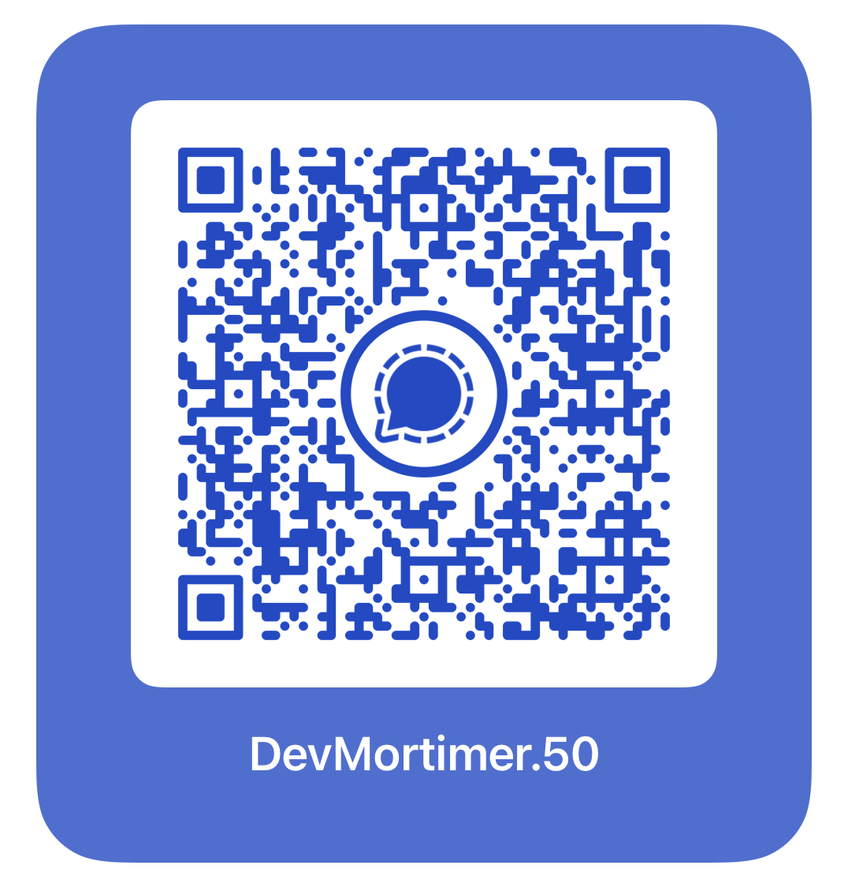

<strong>I love emacs and lisp.</strong>

Right now I build [pi-warden](https://github.com/DevMortimer/pi-warden) and [pi-typesafe](https://github.com/DevMortimer/pi-typesafe): a fast judgment model checks each tool call a coding agent makes, hands the verdict back to the agent, and grades its own decisions on recorded sessions. The README's Calibration section has the numbers.

Day job: [conxi](https://www.linkedin.com/company/conxi/posts/?feedView=all)

If pi-warden saved you from a bad `rm -rf`, [sponsoring](https://github.com/sponsors/DevMortimer) keeps the calibration runs paid for.

	
	
Signal, for anything not fit for an issue.

<picture>
  <source media="(prefers-color-scheme: dark)" srcset="https://github.com/DevMortimer/DevMortimer/raw/refs/heads/output/github-contribution-grid-snake-dark.svg" />
  <source media="(prefers-color-scheme: light)" srcset="https://github.com/DevMortimer/DevMortimer/raw/refs/heads/output/github-contribution-grid-snake.svg" />
  
</picture>
