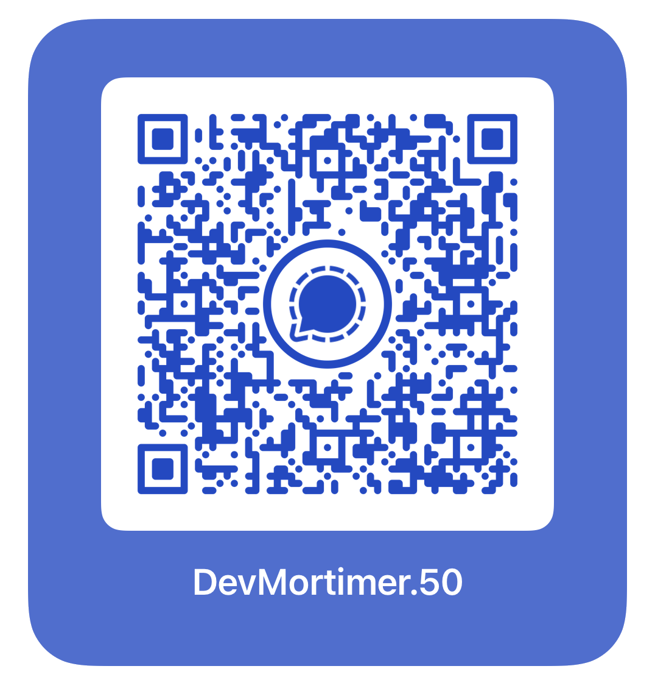

# About Me:

<h1 align="center"><b>Hello! I'm Ryan!</b> </h1>

A highly motivated fourth-year Computer Engineering student with a passion for software development and a strong foundation in Linux. A self-directed learner who thrives in challenging environments, with a proven ability for independent problem-solving and rapid skill acquisition.

---

---

### 💻 Languages and Tools:

---

### 🚀 Frameworks and Technologies:

---

## Contact me at Signal!

	

<picture>
  <source media="(prefers-color-scheme: dark)" srcset="github-contribution-grid-snake-dark.svg" />
  <source media="(prefers-color-scheme: light)" srcset="github-contribution-grid-snake.svg" />
  
</picture>
